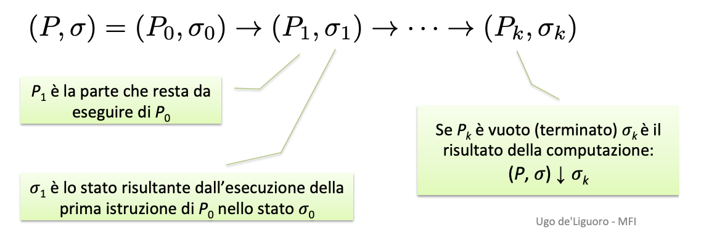

## Verifica Model-based

Modello M (automa) e formula φ

M	⊨ φ   --> M soddisfa φ

Bisogna controllare tutti gli stati di M

## Verifica proof-based o deduttiva

Nella verifica proof-based o deduttiva non si considerano tutti
gli	(infiniti) stati che il sistema/programma	può	attraversare,
ma si cerca	di dimostrare che la relazione input-output R del
programma, descritta dalla formula φR, è deducibile in un
calcolo	logico da un insieme (finito) di ipotesi	Γ

Γ ⊢ φR --> φR è	deducibile da Γ

## Semantica operazionale

