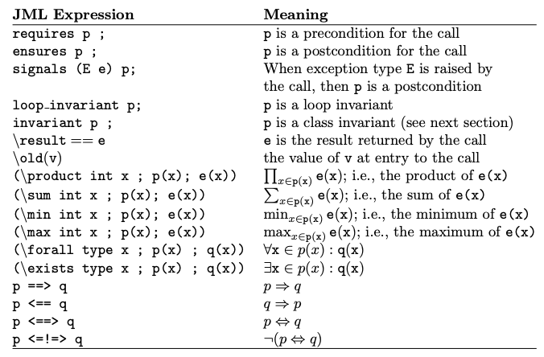

# JML



```
@public normal_behavior := in caso di terminazione
@also public exceptional_behavior := le @ensures sono le precondizioni per l'eccezione
@signals_only Exception := eccezione se le precondizioni si sono verificate
@signals(e Exception) p := post-condizione dell'eccezione
@pure := no side-effects (assegnazioni)
@assignable locazioni modificabili, oppure \nothing (uguale a @pure), \everything, this.*, a[*], a[i..j]

@diverge p; pre-condizione per cui il metodo non esegue il suo normal behavior

prima del parametro
@ non_null @ (default)
@ nullable @

@loop_invariant p; (anche @maintaining)
@decresing e;
```

# Verifast
